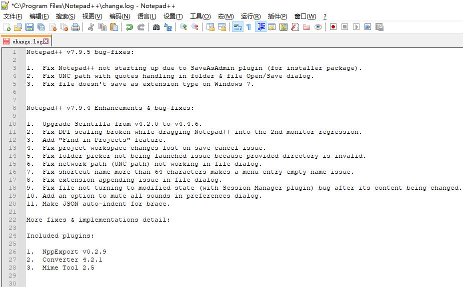

Notepad 系列是 Windows 平台最常用的免费文本编辑器家族。这里介绍三个主流选择：Notepad++、国产替代 Notepad--，以及轻量级的 Notepad3。

## Notepad++

Windows 平台最知名的免费文本编辑器，功能完善，插件丰富。

:::danger
作者曾多次发表不当政治言论。如果你介意，可选择下方的 Notepad-- 或 Notepad3 作为替代。
:::

- 官网：[notepad-plus-plus.org](https://notepad-plus-plus.org/)

## Notepad--

国内作者维护的 Notepad++ 替代品，界面和操作习惯与 Notepad++ 高度一致。

- [Gitee](https://gitee.com/cxasm/notepad--)
- [GitHub](https://github.com/cxasm/notepad--)

## Notepad3

轻量级的文本编辑器，基于 Scintilla，要求 Windows 7 及以上。

- 官网：[rizonesoft.com](https://rizonesoft.com/downloads/notepad3/)
- [GitHub](https://github.com/rizonesoft/Notepad3)
